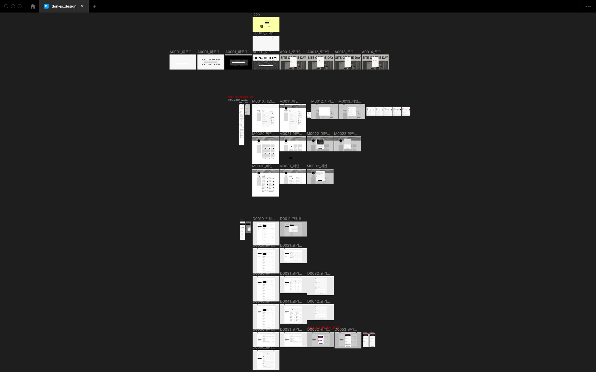
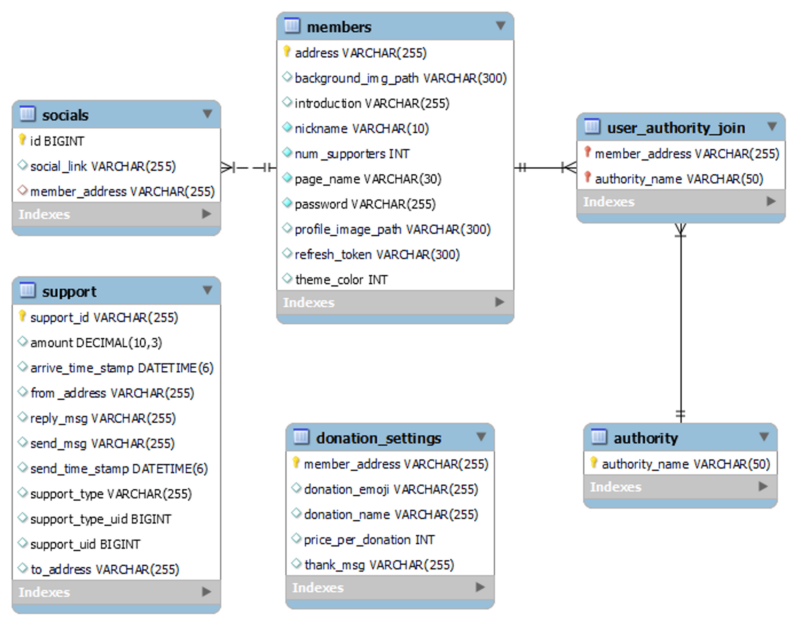
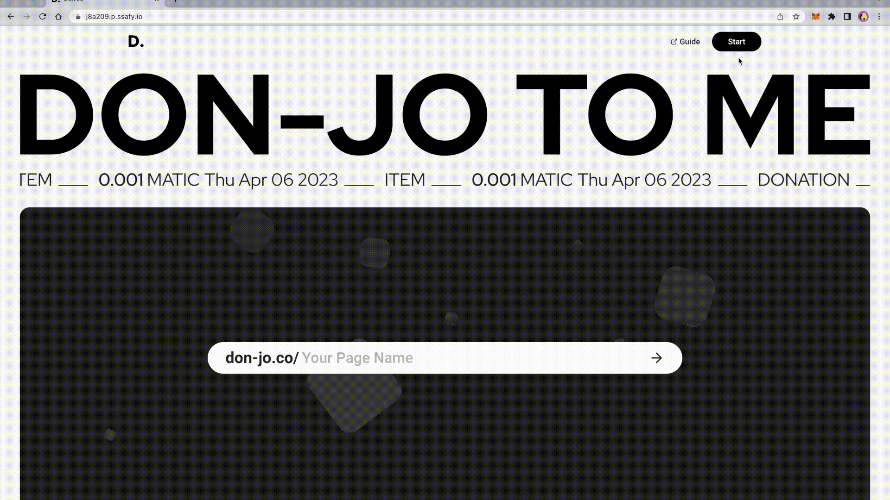
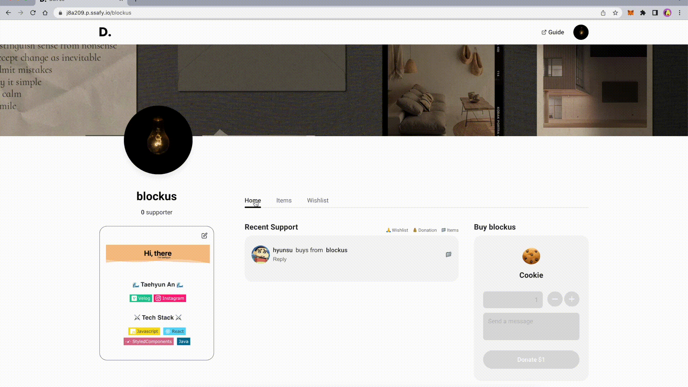
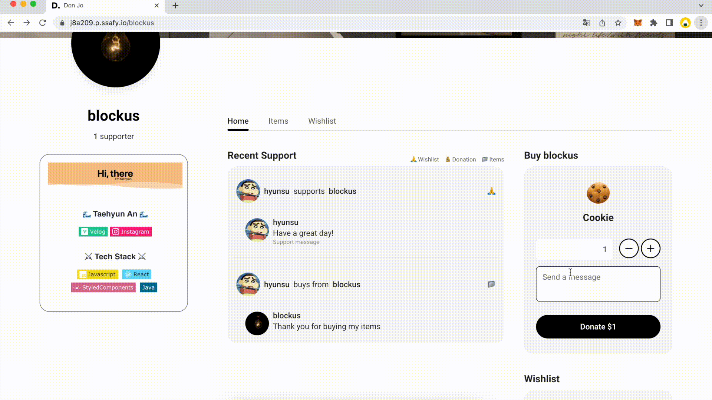
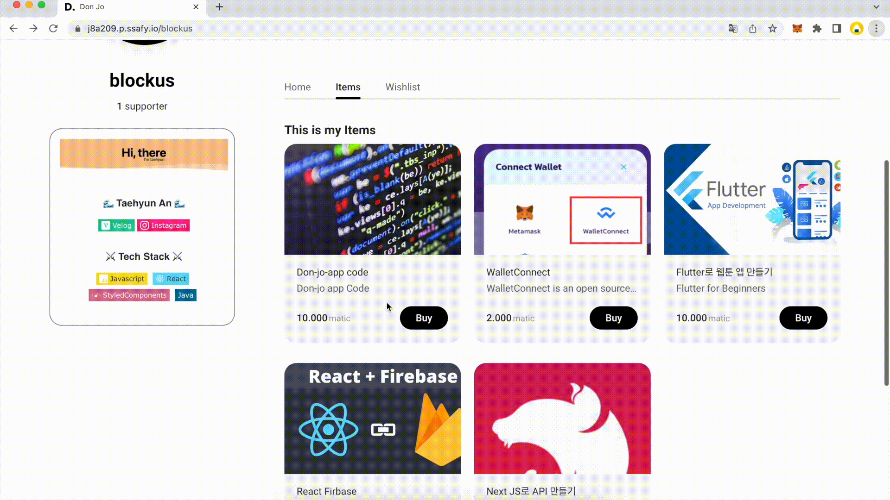
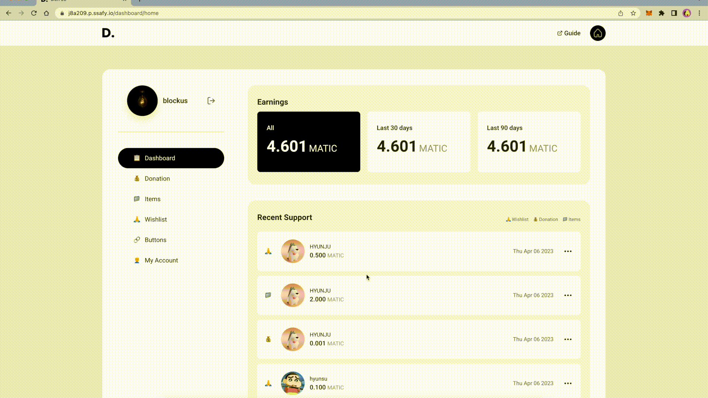
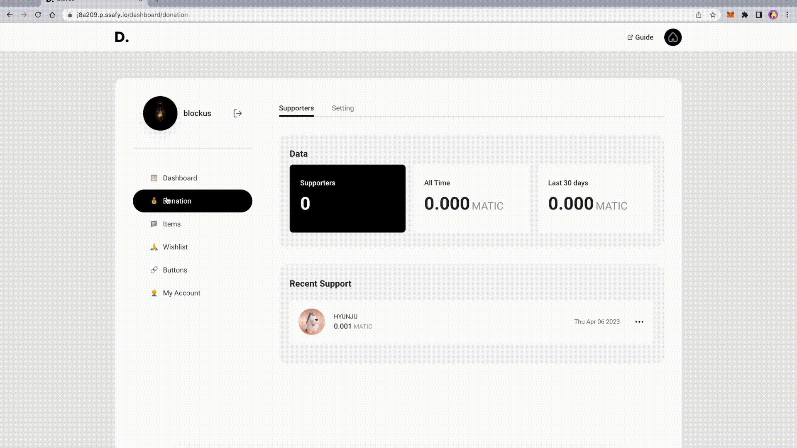
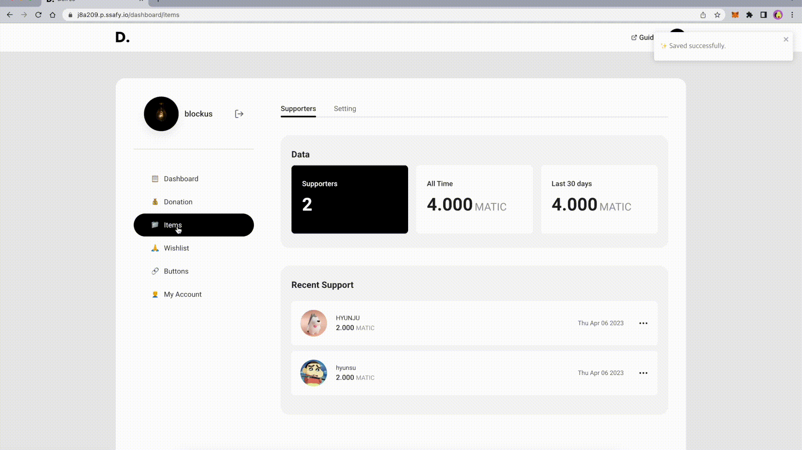
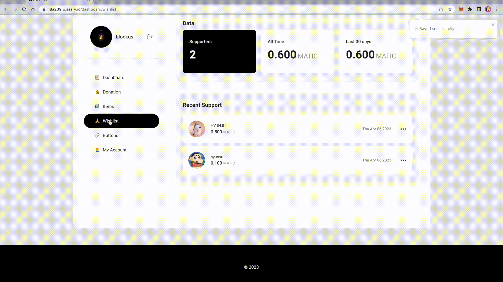

# DONJO - 블록체인 기반 후원 및 거래 서비스

## 📅 프로젝트 기간

2023년 02월 20일 월요일 - 2023년 04월 07일 금요일 (총 기간 : 7주)


## 🌟 프로젝트 개요

1. **Summary(프로젝트 소개 및 요약)**
    - DONJO는 블록체인 기반의 창작자 후원 및 창작물 거래 서비스 입니다.
    - 창작자가 올린 창작물이 도움이 되었다면 후원을 통해 감사 표시를 전할 수 있습니다.
    - 창작물을 필요로 하는 사람들에게 판매할 수 있습니다.
    - 후원자들로부터 창작 활동을 위한 모금을 받을 수 있습니다.

2. **Problem(기존 시스템의 문제점)**
    - velog, github page, tistory 등 다양한 블로그 플랫폼에서는 후원 서비스가 존재하지 않습니다.
    - 또한, 블로그는 방문자 수만으로 수익을 얻기 어려운 구조이기 때문에 창작자가 직접 애드핏과 같은 광고 부착 서비스를 이용해야하며, 이는 방문자 수에 비례한 수익을 얻기가 힘듭니다.
    - 아프리카TV, 트위치, 유튜브 등 후원 서비스가 포함되어 있는 대형 플랫폼에서는 높은 수수료를 지불해야 합니다.

3. **Solution(DONJO 서비스의 해결 방안)**
    - 창작 활동을 하는 공간과 후원을 받을 수 있는 공간을 분리합니다.
    - 다양한 플랫폼을 통해 받은 후원 내역을 통합적으로 관리할 수 있는 서비스를 제공합니다.
    - 대형 플랫폼에 비해 적은 수수료로 서비스를 제공합니다.

4. **Performance(시스템 성과 및 기대효과)**
    - 창작물에 대한 후원, 거래 등 기록을 통합적으로 관리하며, 모든 거래 과정이 투명하게 제공됩니다.
    - 창작자 입장에서 시간과 비용을 절약하면서 더 많은 창작물을 제작할 수 있습니다.
    - 블록체인 기반의 거래를 통해 투명성과 신뢰성을 보장할 수 있습니다.
    - 수수료 절감으로 창작물 제작자들에게 더 많은 수익을 제공할 수 있습니다.

## ✨ 프로젝트 핵심 기능

1. **쉬운 통합 관리**
    - 개인 블로그, 사이트 등에 창작자의 개인 페이지로 이동하는 버튼을 제공합니다.
    - SNS에 업로드 할 수 있는 개인 QR코드를 제공합니다.
2. **투명한 거래**
    - 블록체인을 활용을 통해 후원 내역을 관리하고 후원과정을 모두에게 제공함으로 투명성과 신뢰성을 보장할 수 있습니다.
3. **대시보드 통계 관리** 
    - 개인 계정으로 후원받은 내역을 대시보드에서 통합적으로 확인할 수 있습니다.
    - 총 후원자, 후원금, 수익등 다양한 정보를 한 눈에 확인할 수 있습니다.
    - 창작자 개인 페이지를 테마 색상, 후원 이모지, 금액 설정등을 통해 커스텀화할 수 있습니다.

## 🧑🏻‍💻 팀 구성

- 백엔드
    - 이재욱 - 팀장, API 설계 및 개발, 스마트 컨트랙트 작성 및 배포
    - 강태선 - API 설계 및 개발, 블록체인 후원 및 WalletConnect 연결
    - 이유영 - API 설계 및 개발, CI/CD
- 프론트엔드
    - 김현수 - 회원가입 및 로그인 개발, 블록체인 후원 및 로그인
    - 송현주 - 대시보드 및 인트로 개발, 반응형 UI 구현, 디자인 설계
    - 안태현 - 개인 페이지 개발,  반응형 UI 구현, 디자인 설계

## 🔨 주요 기술

**Backend - Spring**

- IntelliJ IDE
- Java 11.0.14
- Springboot 2.7.7
- Spring Data JPA 2.7.7
- Spring Security 2.7.7
- Spring Validation 2.7.7
- Spring Web 2.7.7
- QueryDSL 5.0.0
- Spring Cloud 2.2.1
- Swagger2 3.0.0
- jjwt 0.11.5
- caffeine 2.9.3
- bucket4j 4.10.0
- gson 2.10.1

**Smart Contract**

- Solidity 0.8.18
- web3j 4.9.4
- web3js 1.8.2
- truffle 4.6.17
- ganache 2.7.0
- geth 1.11.3
- golang 1.20.2

**CI/CD**

- AWS EC2
- Jenkins
- NGINX
- SSL

**Frontend**

- Visual Studio Code IDE
- react 18.2.0
- r*edux 4.2.1*
- *react-redux* 8.0.5
- *redux-persist 6.0.0*
- p*rop-types 15.8.1*
- *styled-components 5.3.8*
- *styled-reset 4.4.5*
- *react-router-dom 6.8.2*
- *react-toastify 9.1.2*
- *react-responsive 9.0.2*
- *react-qrcode-logo 2.9.0*
- *emoji-picker-react 4.4.7*
- *@uiw/react-md-editor 3.20.5*
- *html-to-image 1.11.11*
- *react-spinners 0.13.8*

## 📝 요구사항정의서


## 💄 디자인 시안


## 🔒 ERD


## 📄 아키텍처 구성도


## ⚙️ 프로젝트 파일 구조

**Backend**

```
.
├── .gitignore
├── build.gradle
├── dockerfile
├── gradlew
├── gradlew.bat
├── settings.gradle
└── src
    ├── main
    │   ├── java
    │   │   └── com
    │   │       └── donjo
    │   │           └── backend
    │   │               ├── BackendApplication.java
    │   │               ├── aop
    │   │               │   └── ControllerAspect.java
    │   │               ├── api
    │   │               │   ├── controller
    │   │               │   │   ├── FileController.java
    │   │               │   │   ├── ItemController.java
    │   │               │   │   ├── MemberController.java
    │   │               │   │   ├── PriceController.java
    │   │               │   │   ├── SupportController.java
    │   │               │   │   ├── TestController.java
    │   │               │   │   └── WishlistController.java
    │   │               │   ├── dto
    │   │               │   │   ├── item
    │   │               │   │   │   ├── request
    │   │               │   │   │   │   ├── AddItemCond.java
    │   │               │   │   │   │   └── UpdateItemCond.java
    │   │               │   │   │   └── response
    │   │               │   │   │       ├── GetAllMyItemPayload.java
    │   │               │   │   │       ├── GetItemListPayload.java
    │   │               │   │   │       └── ItemDetailPayload.java
    │   │               │   │   ├── member
    │   │               │   │   │   ├── DonationSettingItem.java
    │   │               │   │   │   ├── LoginItem.java
    │   │               │   │   │   ├── MemberInfoItem.java
    │   │               │   │   │   ├── WishListItem.java
    │   │               │   │   │   ├── request
    │   │               │   │   │   │   ├── LoginMemberCond.java
    │   │               │   │   │   │   ├── ModifyMemberCond.java
    │   │               │   │   │   │   └── SignUpMemberCond.java
    │   │               │   │   │   └── response
    │   │               │   │   │       ├── FindMemberPayload.java
    │   │               │   │   │       ├── FindPageInfoPayload.java
    │   │               │   │   │       ├── FromMemberItem.java
    │   │               │   │   │       ├── LoginPayload.java
    │   │               │   │   │       ├── SocialItem.java
    │   │               │   │   │       ├── SupportItem.java
    │   │               │   │   │       └── ToMemberItem.java
    │   │               │   │   ├── support
    │   │               │   │   │   ├── request
    │   │               │   │   │   │   ├── AddReplyCond.java
    │   │               │   │   │   │   ├── AddSupportCond.java
    │   │               │   │   │   │   └── DonationSettingCond.java
    │   │               │   │   │   └── response
    │   │               │   │   │       ├── FindSupportDetailPayload.java
    │   │               │   │   │       ├── FindSupportItem.java
    │   │               │   │   │       ├── FindSupportListPayload.java
    │   │               │   │   │       ├── FindTop10Payload.java
    │   │               │   │   │       └── MemberItem.java
    │   │               │   │   └── wishlist
    │   │               │   │       ├── request
    │   │               │   │       │   ├── AddWishlistCond.java
    │   │               │   │       │   └── UpdateWishlistCond.java
    │   │               │   │       └── response
    │   │               │   │           ├── GetWishlistsPayload.java
    │   │               │   │           └── WishlistDetailPayload.java
    │   │               │   └── service
    │   │               │       ├── item
    │   │               │       │   ├── ItemService.java
    │   │               │       │   └── ItemServiceImpl.java
    │   │               │       ├── member
    │   │               │       │   ├── MemberService.java
    │   │               │       │   └── MemberServiceImpl.java
    │   │               │       ├── price
    │   │               │       │   ├── PriceService.java
    │   │               │       │   └── PriceServiceImpl.java
    │   │               │       ├── s3
    │   │               │       │   └── S3Uploader.java
    │   │               │       ├── support
    │   │               │       │   ├── SupportService.java
    │   │               │       │   └── SupportServiceImpl.java
    │   │               │       └── wishlist
    │   │               │           ├── WishlistService.java
    │   │               │           └── WishlistServiceImpl.java
    │   │               ├── config
    │   │               │   ├── CorsConfig.java
    │   │               │   ├── QueryDslConfig.java
    │   │               │   ├── RateLimitConfig.java
    │   │               │   ├── SecurityConfig.java
    │   │               │   ├── SwaggerConfig.java
    │   │               │   ├── bucket
    │   │               │   │   └── RateLimitFilter.java
    │   │               │   └── jwt
    │   │               │       ├── JwtAccessDeniedHandler.java
    │   │               │       ├── JwtAuthenticationEntryPoint.java
    │   │               │       ├── JwtFilter.java
    │   │               │       ├── JwtSecurityConfig.java
    │   │               │       └── TokenProvider.java
    │   │               ├── db
    │   │               │   ├── entity
    │   │               │   │   ├── Authority.java
    │   │               │   │   ├── DonationSetting.java
    │   │               │   │   ├── Member.java
    │   │               │   │   ├── Social.java
    │   │               │   │   └── Support.java
    │   │               │   └── repository
    │   │               │       ├── DonationSettingRepository.java
    │   │               │       ├── MemberRepository.java
    │   │               │       ├── MemberRepositorySupport.java
    │   │               │       ├── SupportRepository.java
    │   │               │       └── SupportRepositorySupport.java
    │   │               ├── exception
    │   │               │   ├── BadRequestException.java
    │   │               │   ├── DuplicateDataException.java
    │   │               │   ├── DuplicateMemberException.java
    │   │               │   ├── NoContentException.java
    │   │               │   └── UnAuthorizationException.java
    │   │               ├── solidity
    │   │               │   ├── Item
    │   │               │   │   ├── ItemSol.java
    │   │               │   │   └── ItemSolidity.java
    │   │               │   ├── support
    │   │               │   │   ├── SupportSol.java
    │   │               │   │   └── SupportSolidity.java
    │   │               │   └── wishlist
    │   │               │       ├── WishlistSol.java
    │   │               │       └── WishlistSolidity.java
    │   │               └── util
    │   │                   ├── ConvertUtil.java
    │   │                   └── Web3jUtil.java
    │   └── resources
    │       ├── application.yml
    │       └── data.sql
    └── test
        └── java
            ├── com
            │   └── donjo
            │       └── backend
            │           ├── api
            │           │   ├── controller
            │           │   │   └── SupportControllerTest.java
            │           │   └── service
            │           │       ├── item
            │           │       │   └── ItemServiceImplTest.java
            │           │       ├── support
            │           │       │   └── SupportServiceImplTest.java
            │           │       └── wishlist
            │           │           └── WishlistServiceImplTest.java
            │           ├── contract
            │           │   ├── ContractConnectionTest.java
            │           │   ├── ContractViewTest.java
            │           │   └── SignatureCheckTest.java
            │           ├── contracts
            │           │   ├── ContractViewTest.java
            │           │   ├── ContractWriteTest.java
            │           │   ├── EC2ContractViewTest.java
            │           │   ├── ItemContractTest.java
            │           │   └── TransactionTest.java
            │           ├── solidity
            │           │   ├── Item
            │           │   │   ├── ConnectTest.java
            │           │   │   └── ItemSolidityTest.java
            │           │   └── wishlist
            │           │       └── WishlistSolSolidityTest.java
            │           └── util
            │               ├── ConvertUtilTest.java
            │               └── Web3jUtilTest.java
            └── controller
                └── MemberControllerTest.java
```

**Frontend**

```
.
├── don-jo-app
│   ├── Dockerfile
│   ├── node_modules
│   ├── package-lock.json
│   ├── package.json
│   ├── public
│   │   ├── favicon.ico
│   │   ├── index.html
│   │   ├── manifest.json
│   │   └── robots.txt
│   └── src
│       ├── App.js
│       ├── AppRouter.js
│       ├── api
│       │   ├── file.js
│       │   ├── items.js
│       │   ├── member.js
│       │   ├── price.js
│       │   ├── support.js
│       │   ├── utils
│       │   │   └── index.js
│       │   ├── wagmi
│       │   │   ├── buyItem.js
│       │   │   ├── donate.js
│       │   │   ├── donateWishlist.js
│       │   │   └── walletConnectSetting.js
│       │   └── wishlist.js
│       ├── assets
│       │   ├── fonts
│       │   │   ├── BlackHanSans.ttf
│       │   │   ├── DoHyeon.ttf
│       │   │   ├── Jua.ttf
│       │   │   └── Sunflower.ttf
│       │   └── img
│       │       ├── common
│       │       │   ├── app-logo.svg
│       │       │   ├── blockchain.jpg
│       │       │   ├── default-profile.svg
│       │       │   ├── home.png
│       │       │   └── img-not-found.svg
│       │       ├── dashboard
│       │       │   ├── img-generate-button.jpg
│       │       │   ├── img-generate-qrcode.jpg
│       │       │   └── qr-logo.svg
│       │       └── intro
│       │           ├── undraw_button.svg
│       │           ├── undraw_ether.svg
│       │           ├── undraw_transaction.svg
│       │           └── undraw_transfer_money.svg
│       ├── components
│       │   ├── Common
│       │   │   ├── BasicButton
│       │   │   ├── BasicInput
│       │   │   ├── BasicLink
│       │   │   ├── BasicTextarea
│       │   │   ├── BasicTitle
│       │   │   ├── Footer
│       │   │   ├── Header
│       │   │   │   └── SelectBox
│       │   │   ├── Modal
│       │   │   │   ├── AddItemModal
│       │   │   │   ├── AddWishlistModal
│       │   │   │   ├── AskSignUpModal
│       │   │   │   ├── BasicModal
│       │   │   │   ├── ContractModal
│       │   │   │   ├── FullScreenModal
│       │   │   │   ├── ItemDetailModal
│       │   │   │   ├── PasswordCheckModal
│       │   │   │   ├── PasswordSetModal
│       │   │   │   └── WishlistDetailModal
│       │   │   ├── ProfileImg
│       │   │   ├── ShowMoreButton
│       │   │   ├── SignUp
│       │   │   │   └── SignUpModal
│       │   │   ├── Template
│       │   │   ├── WalletConnectLogin
│       │   │   │   └── Login
│       │   │   └── WishlistItem
│       │   ├── DashBoard
│       │   │   ├── DashBoardAccount
│       │   │   ├── DashBoardButtons
│       │   │   │   └── GeneratorItem
│       │   │   ├── DashBoardCard
│       │   │   ├── DashBoardContent
│       │   │   ├── DashBoardCustomSelect
│       │   │   ├── DashBoardDonation
│       │   │   │   ├── DonationForm
│       │   │   │   └── DonationSupporter
│       │   │   ├── DashBoardEarning
│       │   │   ├── DashBoardGeneratorModal
│       │   │   ├── DashBoardHome
│       │   │   ├── DashBoardItems
│       │   │   │   ├── ItemsSettings
│       │   │   │   │   └── ListItem
│       │   │   │   └── ItemsSupporter
│       │   │   ├── DashBoardListItem
│       │   │   ├── DashBoardSupportList
│       │   │   ├── DashBoardTab
│       │   │   ├── DashBoardWishlist
│       │   │   │   ├── WishlistSettings
│       │   │   │   │   └── DashboardWishlist
│       │   │   │   └──WishlistSupporter
│       │   │   ├── DashboardLoading
│       │   │   ├── DashboardQRModal
│       │   │   └── NavBar
│       │   ├── Intro
│       │   │   ├── CurrentSupportRecent
│       │   │   ├── DonJoTitleSvg
│       │   │   └── IntroContent
│       │   └── Personal
│       │       ├── ExternalLink
│       │       ├── IntroductionEdit
│       │       ├── PersonalContent
│       │       ├── PersonalHome
│       │       │   ├── HomeDonation
│       │       │   ├── HomeRecentSupport
│       │       │   │   └── RecentSupportBlock
│       │       │   └── HomeWishlist
│       │       │       └── WishlistCard
│       │       ├── PersonalItems
│       │       │   └── ItemsCard
│       │       ├── PersonalTab
│       │       └── PersonalWishlist
│       ├── contracts
│       │   ├── ApplicationHandler.json
│       │   ├── BasicDonation.json
│       │   ├── ItemDonation.json
│       │   ├── SupportHistory.json
│       │   └── WishlistDonation.json
│       ├── data
│       │   ├── dashboard.js
│       │   └── intro.js
│       ├── hooks
│       │   ├── useInput.js
│       │   └── useTabs.js
│       ├── index.js
│       ├── pages
│       │   ├── DashBoard
│       │   ├── Error
│       │   ├── Intro
│       │   └── Personal
│       ├── stores
│       │   ├── donation
│       │   ├── items
│       │   ├── member
│       │   ├── memberInfo
│       │   ├── reducers.js
│       │   ├── store.js
│       │   ├── support
│       │   ├── web3
│       │   └── wishlist
│       ├── styles
│       │   └── GlobalStyles.js
│       └── utils
│           ├── calculateEth.js
│           ├── connectWallet.js
│           ├── getEarningDataByType.js
│           ├── handleWalletChange.js
│           ├── metamaskLogIn.js
│           ├── sendToastMessage.js
│           ├── transactionFunc
│           │   ├── buyItemDonation.js
│           │   ├── buyWishlistDonation.js
│           │   └── donation.js
│           └── validation
│               ├── checkItemValidation.js
│               ├── checkSignUpValidation.js
│               └── validator.js
└── don-jo.txt

```

## 🗣 협업 환경

- Jira
    - 프로젝트 스프린트를 정하고 한 주의 계획대로 프로젝트를 진행했습니다.
    - 팀원마다 주간 40의 Story Point를 설정하였습니다.
    
- Notion
    - 데일리 회의 스크럼, 요구 사항 정의서, API 명세서등을 문서화했습니다.
    - 코딩 컨벤션, 깃 컨벤션 등 팀원간 개발 규칙을 정의했습니다.
- Github
    - 코딩 컨벤션을 준수하며 프로젝트를 진행하였습니다.
    - Pull Request를 요청하고 팀원들과 코드리뷰를 진행하였습니다.
- Figma
    - 웹 페이지의 디자인 와이어프레임, 시안을 제작하였습니다.
    - 서비스 프로토타입을 제작하였습니다.

## 💪🏻 성장한 점

- 블록체인 기술 이해도 향상
    - 블록체인의 작동 방식, 특징, 장단점 등에 대해 학습하고 이해하는 시간이었습니다.
    - Solidity와 같은 계약 지향 프로그래밍 언어를 다루어 볼 수 있는 시간이었습니다.
- 팀 협업 능력 및 의사소통 능력 향상
    - 데일리 스크럼을 진행하며 진행 상황과 이슈 등을 공유하였습니다.
    - 서로의 역할을 이해하고 존중 및 수용하는 과정을 배울 수 있었습니다.
    - 예상치 못한 문제나 기술적 제한 상황에 함께 고민하고 해결책을 만들어 왔습니다.

## 🙏🏻 아쉬운 점(개선하고 싶은 점)

- 후원자 전용 대시보드 제공
    - 후원자는 자신이 후원한 프로젝트의 진행 상황, 사용 예산, 결과물 등을 실시간으로 확인할 수 있습니다.
    - 후원자들에게 프로젝트에 대한 새로운 업데이트나 소식을 제공할 수 있습니다.
- 후원 내역 필터링 및 시각적 요소 제공
    - 창작자는 특정 기간동안의 후원 금액 추이와 분포를 쉽게 파악할 수 있습니다.
    - 시각화 요소를 통해 통계 정보를 한눈에 확인할 수 있고, 향후 전략을 세우는데 도움을 줄 수 있습니다.

## Don-Jo 서비스 화면

### 🧩 인트로

- 최근 진행된 10건의 후원 내역을 제공합니다. 후원 내역에는 시간, 후원 유형, 금액 정보가 포함되어 있습니다.
- 로그인 여부에 따라 화면 중앙에 입력창이 동작합니다.
    - 비로그인 상태인 경우, 회원가입을 진행합니다.
    - 로그인 상태인 경우, 개인 페이지로 이동합니다.


### 🧩 가이드

- 인트로 페이지의 `Guide` 버튼을 눌러 가이드 페이지로 이동합니다.
- Don-Jo 서비스 및 블록체인 지갑 생성, 연결 방법 등의 가이드를 제공합니다.


### 🧩 회원가입

- 화면 상단의 `Start` 버튼을 클릭하여 회원가입을 진행합니다.
- Wallet Connect API를 이용하여 블록체인 지갑을 연결하고 회원가입 할 수 있습니다.
- 개인 페이지 이름(`pageName`)은 타 사용자와 중복될 수 없습니다.
    

    

### 🧩 로그인

- Wallet Connect API를 이용하여 해당 지갑 주소로 로그인을 할 수 있습니다.
    

    

### 🧩 개인페이지

### Home

- 개인 페이지의 기본 탭으로 창작자의 정보, 후원 내역을 확인할 수 있고, 기본 후원을 진행할 수 있습니다.
- 프로필 이미지, 배경 이미지 위에 버튼을 클릭해 이미지를 변경할 수 있습니다.
- 자기소개글을 편집할 수 있는 MD Editor를 제공합니다. 텍스트, 이미지, HTML태그 등을 첨부할 수 있습니다.
- 최근 후원 목록의 요소를 선택하여 후원 내역의 상세 정보를 조회할 수 있습니다. `Transaction Hash`을 이용합니다.


- 창작가는 최근 후원 내역에 답글을 등록/수정/삭제 할 수 있습니다.


- `Transaction Hash` 를 이용해 `polygonscan`웹 사이트로 이동하여 거래의 상세 내역을 확인할 수 있습니다.



### Items

- 창작자가 자신의 창작물을 등록하고 판매할 수 있는 탭입니다.
- 추가 버튼을 클릭하여 새로운 아이템을 등록할 수 있습니다. 이름, 가격, 파일등을 입력할 수 있습니다.


- 후원자는 원하는 창작물의 `buy`버튼을 클릭하여 구매할 수 있습니다.
- 구매된 아이템은 자동 다운로드를 통해 창작물의 기기 환경에 저장됩니다.



### Wishlist

- 향후의 창작물을 위해서 창작자가 필요한 물품 혹은 서비스를 등록하고 후원 받을 수 있습니다.
- 추가 버튼을 통해 새로운 정보를 등록할 수 있습니다. 이름, 가격, 이미지 등 정보를 입력합니다.


- 후원자는 등록된 위시리스트 아이템에 원하는 금액만큼 후원할 수 있습니다.


### 🧩 대시보드

### Home

- 후원받은 모든 카테고리에 대하여 총 금액, 30일동안의 금액, 90일 동안의 금액으로 나뉘어 받은 금액을 확인할 수 있습니다.
- 후원 내역 목록을 클릭하면 해당 후원에 대한 상세정보를 볼 수 있습니다.


### Donation

- 기본 후원을 받은 내역들을 보여주는 탭입니다.
- 설정에서는 후원의 대표 이모지와 이름, 1개당의 가격 및 후원자에게 보낼 감사메세지를 설정할 수 있습니다.


### Items

- 아이템을 판매하여 얻은 수익과 내역을 보여주는 탭입니다.
- 추가 버튼을 클릭하여 새로운 아이템을 등록할 수 있습니다. 이름, 가격, 파일등을 입력할 수 있습니다.
- 수정 혹은 삭제하고 싶은 아이템을 클릭하면 이름, 가격, 파일 등을 수정하거나 삭제할 수 있습니다.
- 아이템 당 구매한 사람의 수, 얻은 수익을 확인할 수 있습니다.



### Wishlist

- 향후 창작물을 위한 위시리스트로 후원 받은 금액과 내역을 보여주는 탭입니다.
- 추가 버튼을 클릭하여 새로운 위시리스트를 등록할 수 있습니다. 이름, 가격, 파일 등을 입력할 수 있습니다.
- 수정 혹은 삭제하고 싶은 위시리스트를 클릭하면 이름, 가격, 파일 등을 수정하거나 삭제할 수 있습니다.



### Buttons

- 나의 후원페이지로 이동하기 위한 플러그인을 생성할 수 있는 페이지 입니다.
- 다른 블로그 등에 플러그인을 삽입하여 내 후원페이지로 이동시킬 수 있습니다.
    - velog, 티스토리 등 md 언어로 작성하는 블로그에서는 생성된 a 태그를 붙여넣어 버튼을 생성할 수 있습니다. 또한 해당 버튼의 png 파일도 제공합니다.
    - 모바일 사용자들을 위한 QR코드 이미지를 제공합니다.
    - 창작자가 올린 아이템들 중 특정한 아이템의 페이지로 이동하는 플러그인을 제공합니다.


### My Account

- 사용자가 자신의 프로필 사진, 배경사진, 닉네임, 외부링크, 페이지네임 등을 변경할 수 있습니다.
    - 페이지네임은 페이지네임과 중복 될 수 없습니다.
- 개인페이지에 적용하고 싶은 테마 컬러를 고를 수 있습니다.

